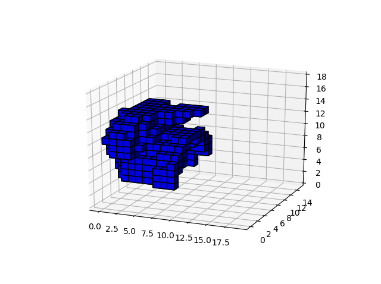

# Voxel model augment

Snippet for voxel model augmentation.

## Related libraries
To install related libraries, please try following:
<pre>
pip install -r requirements.txt
</pre>

## Usage
<pre>
python voxel_augment.py npy_path side_lenght
</pre>

## Sample
I'll try augment for file in ./sample.

<pre>
python voxel_augment.py ./sample/voxcelized.npy 10
</pre>

### Original model

### Augmented model
